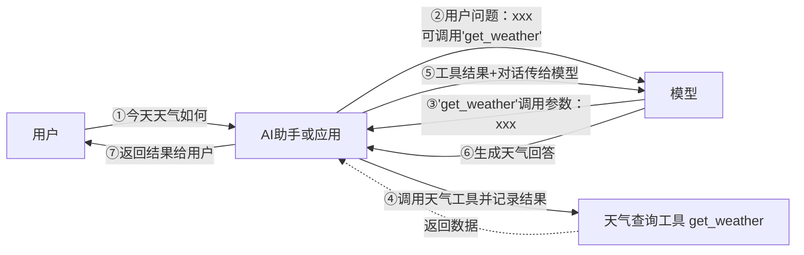

# 1.LangChain是什么
LangChain是一个面向LLM应用开发的开源框架。他本身不是大模型，也不是数据库；他更像一层“应用编排层”，负责把模型、提示词、外部工具、知识、Memory、输出解析、调试追踪等能力组织成一个完整、可维护、可拓展的AI应用

比如说，在一个“企业知识库问答助手”中，用户提问后，系统需要先去向量库检索相关资料，再把检索结果和问题组装成prompt，然后让大模型生成答案，最后把结果整理后返回前端，这里真正扮演组织者角色的就是LangChain

一句话来说,**LangChain = 用代码把大模型和外部世界连接起来的应用开发框架**

其中，Lang 指的是Language Model，Chain指的是把多个环节形成流程。现在的LangChain，围绕Agent、RAG、工具调用、状态管理、可观测性形成了一整套生态

从工程视角看，LangChain 的价值不在于“替你发一次请求”，而在于帮你把下面这些原本零散的东西组织起来：

- 不同厂商的大模型调用方式
    
- Prompt 与多角色消息
    
- 结构化输出与解析
    
- 检索增强生成（RAG）
    
- 工具调用、Agent、多步任务
    
- 记忆、会话状态、持久化
    
- 日志、追踪、调试、评估
    

这也是为什么它会被很多人看作 AI 应用开发里的“基础框架”。

## 1.1 已经可以直接调模型，为什么还要学LangChain
直接调api可以，做简单任务时甚至更直接；但是你开始做应用，框架就会越来越有价值
放到项目开发里，两种路线的边界大致是：

- **只调 API**：适合单次文本生成、简单脚本、快速验证。
- **用 LangChain**：适合做成真实应用，例如客服助手、知识库问答、数据分析助手、工具调用 Agent、多轮对话系统。

所以，LangChain 不是“必须学”，但如果你的目标是做 **RAG、Agent、企业级 AI 应用、AI 服务接入现有业务系统**，它会显著降低你后续的组织成本。


## 1.2 Langchain和Coze/Dify区别
很多人第一次接触 LangChain 时，都会问一句：**“我不是已经会用 Coze 或 Dify 了吗，为什么还要学这个？”**

本质上，它们不是同一类东西：

|维度|Coze / Dify 等平台|LangChain|
|---|---|---|
|**是什么**|**产品 / 平台**：通过网页可视化界面、工作流节点、知识库管理等方式搭建 AI 应用|**代码框架 / 库**：在 Python 或 JS 中以代码方式编排模型、工具、RAG、Agent|
|**使用方式**|打开浏览器，拖拽节点、配置模型、填写提示词、连接知识库，最后发布应用或 API|在本地或服务器写代码，安装依赖，调用 LangChain API 构建自己的 AI 应用|
|**适合谁**|产品、运营、低代码开发者，或希望快速验证业务想法的人|开发者、后端、算法工程师，需要把 AI 能力深度接入已有系统的人|
|**灵活性**|受限于平台已有节点、插件、部署方式和权限设计|由代码完全控制，可接内部 API、自建数据库、私有模型、定制工具链|
|**典型场景**|快速做一个客服机器人、知识库问答、流程自动化 Demo|做企业内部 AI 中台、复杂 RAG 服务、可定制 Agent、与业务系统深度耦合的服务|

实际项目里，这两类工具经常不是“二选一”，而是**先平台、后框架；先低代码验证，再代码化落地**：

- 在业务探索阶段，用 **Coze / Dify** 快速验证需求。
    
- 在需要深度定制、接公司内部系统、做复杂编排时，用 **LangChain / LangGraph** 重构为代码服务。
    

这个思路，和你在本套教程里前半部分先学 Coze / Dify，后半部分再进入 LangChain / LangGraph，正好是一致的。


## 1.3 LangChain的主要模块

- langchain-core：官方推荐的核心API,比如Runnable,BaseMessage等
- langchain-classic：冗余代码或不推荐使用的经典API移到此
- langchain-community：第三方集成，比如：langchain-openai、langchain-anthropic，按需安装，避免臃肿
- langgraph:深度整合LangGraph 1.0，协调多个Chain，Agent、Tools完成更复杂的任务，而且支持循环调用


## 1.4 LangChain家族四大支柱

![[LangChain智能体生命周期.png|697]]
### 1.4.1 LangChain(基础能力层)
LangChain为开发者提供了调用模型、工具和中间件集成、智能体构建等一整套基础能力
核心价值：
- 统一的模型抽象层：屏蔽了不同模型服务商的接口差异，提供了一致的调用方式
- 高度模块化的设计：使用Message、Tool、Agent、Middleware等组件实现灵活的拓展
- 丰富的集成生态：预备了丰富的数据源、api、中间件等
结论：如果你需要构建简单智能体应用，无需复杂的编排，就选择LangChain
### 1.4.2 LangGraph(运行时编排层)
当智能体的任务从单一指令拓展为多步骤、有状态的复杂工作流时，Langgraph通过将智能体内部抽象为一张有向图来编排，通过节点、边、状态的图示结构，使得智能体的工作流节点交互变得显示、可控、可观测
### 1.4.3  DeepAgent(智能体的执行框架)
DeepAgent是新推出的全新组件，被定位为Agent Harness（智能体执行框架）。他构建在LangChain和LangGraph之上，增加了规划能力、文件系统、子Agent等高级功能。让开发者无须从0构建复杂的控制逻辑，即可创建具备深度规划、长期记忆和多专家协作能力的智能体。
核心能力：显式规划、虚拟文件系统、子智能体、长期记忆、可拓展中间件
![[LangChain、LangGraph、DeepAgent关系.png]]
用LangChain快速搭建，用LangGraph打磨生产稳定性，用Deep Agent赋予Agent更强的自主能力能力--这才是完整的LangChain玩法
### 1.4.4 LangSmith(可视化监控和测试平台)
当智能体系统逐渐复杂时，单靠日志和打印输出调试无法满足调试和质量管理的需求

LangSmith是LangChain推出的可视化监控和测试平台，用于跟踪、记录、分析智能体在运行过程中的完整调用链路，让智能体内部运行过程变得透明和可评估


# 2.LangChain模型调用
langchain内部设置了统一接口，如ChatDeepSeek，ChatOpenAi等
此处我们要介绍的是init_chat_model
问题：init_chat_model和直接使用ChatTongyi、ChatOpenAI有什么区别？
- 统一接口：无需记住每个提供商的不同初始化方式
- 易于切换：简化了智能体系统中模型切换策略（只需修改模型字符串）
- 简洁明了：更简洁的语法，减少样板代码
- 自动适配：内部根据模型标识自动选择对应的驱动类（ChatOpenAI、ChatDeepSeek）

## 2.2 参数
| **参数**               | **类型** | **说明**                                                                                                                                                 | **默认值**           |
| -------------------- | ------ | ------------------------------------------------------------------------------------------------------------------------------------------------------ | ----------------- |
| ```model```          | str    | 模型名称（必需）                                                                                                                                               | 无                 |
| ```model_provider``` | str    | 模型提供商名称                                                                                                                                                | 无                 |
| ```api_key```        | str    | API密钥。如果不提供，会从环境变量中读取(如`DEEPSEEK_API_KEY`)                                                                                                             | None              |
| ```base_url```       | str    | 大模型供应商API请求地址                                                                                                                                          | None              |
| ```temperature```    | float  | 控制输出随机性，范围0.0-2.0，温度越高输出越随机          `0.0`：最确定性，输出几乎不变                                          `1.0`:平衡创造性和一致性                        `2.0`：最随机，最有创造性 | 0.7               |
| ```max_tokens```     | int    | 限制模型输出的最大token数                                                                                                                                        | None              |
| ```timeout```        | float  | 超时时间(秒)，超时未响应，请求会被取消                                                                                                                                   | None              |
| `max_retries`        | int    | 请求失败(如网络问题、速率限制)时的最大重试次数                                                                                                                               | 6，claude code应该是7 |

temperature参数根据使用场景选择：

| **Temperature 取值** | **输出特点**                                 | **适用场景实例**                     |
| ------------------ | ---------------------------------------- | ------------------------------ |
| **0.0**            | **确定性最高。** 结果基本完全固定，每次输入得到的回答几乎都一样。      | 代码生成、数学计算、客观事实问答、数据提取。         |
| **0.2 ~ 0.5**      | **专注且严谨。** 在保证事实准确性的前提下，语言流畅度较好，极少胡言乱语。  | 专业文档翻译、技术文档编写、学术总结。            |
| **0.7 ~ 0.8**      | **均衡型（多数 AI 的默认值）。** 兼顾了语言的丰富度和基本逻辑的合理性。 | 日常对话、邮件撰写、通用的文章创作。             |
| **1.0 ~ 1.2**      | **高创造性。** 词汇选择更多样，思维更发散，但偶尔会出现逻辑跳跃。      | 头脑风暴、故事创作、广告文案、角色扮演（Roleplay）。 |
| **> 1.5**          | **极度混乱。** 词汇组合变得怪异，极易产生逻辑断层或乱码。          | 很少在实际业务中使用，仅用于极端压力测试或纯随机文本实验。  |

Token:大模型通过分词器将文本拆分后的最小语义单位，大语言模型将此作为收费依据

## 2.3 模型的调用
LangChain在模型调用上提供了几个核心的调用方式：
- `invoke`:阻塞式，一次性返回完整结果问答、批处理任务、无需实时反馈的场景
 基本语法：
 ```
 response = model.invoke(input,config=None)
 ```
 invoke的返回值:
 ```
 AIMessage(
    content='2', ##模型生成的答案
    additional_kwargs={'refusal': None, ' ##拒绝回答的情况 None表示安全
	#--- 响应元数据(api返回的详细原始数据) ---
	content': '我们要求1+1=?，只回复答案数字，所以答案是2。'},
    response_metadata={
        'token_usage': {
            'completion_tokens': 18, 
            'prompt_tokens': 18,
            'total_tokens': 36,
            'completion_tokens_details': {
                'accepted_prediction_tokens': None, #预测生成的token数
                'audio_tokens': None,
                'reasoning_tokens': 16,#推理模型消耗的token
                'rejected_prediction_tokens': None #被拒绝的预测Token
            },
            'prompt_tokens_details': {'audio_tokens': None,  #输入的音频Token数
            'cached_tokens': 0},
            'prompt_cache_hit_tokens': 0, #命中的缓存token数
            'prompt_cache_miss_tokens': 18
        },
        'model_provider': 'deepseek',
        'model_name': 'deepseek-v4-flash',
        'system_fingerprint':  'fp_8b330d02d0_prod0820_fp8_kvcache_20260402', #系统指纹，用来追踪模型后端的配置变更
        'id': '36156ac5-dd6c-4862-8e15-ede90afbbfbb',
        'finish_reason': 'stop',
        'logprobs': None
    },
    
    # LangChain内部唯一标识
    id='lc_run--019f4a76-ff41-7db2-a062-628fb62ab27d-0',
    
    #工具调用信息
    tool_calls=[], #正常触发的外部工具调用列表
    invalid_tool_calls=[], #触发失败或格式错误的工具调用
    
    #统一消耗元数据（LangChain标准化后的消耗格式）
    usage_metadata={
        'input_tokens': 18,
        'output_tokens': 18,
        'total_tokens': 36,
        'input_token_details': {'cache_read': 0}, #从缓存中读取的输入数量
        'output_token_details': {'reasoning': 16}
    }
)
 ```
 
- `ainvoke`:非阻塞式，提高系统吞吐量高并发web应用、IO密集型任务
- `stream`:流式输出，实时返回每个Token。聊天机器人、长文本生成，需要提升用户体验的交互应用。调用后，返回一个迭代器（iterator），可以通过循环实时处理每一个新的chunk内容块
  stream的优点：
   - `响应速度更快` -用户不必等待完整输出
   - `交互体验更流畅` -尤其是在长文本或复杂推理场景下
   - `可实时展示模型思考过程` 
- `astream`:非阻塞式，提高系统吞吐量高并发web应用、IO密集型任务
- `batch`：批量处理多个输入高并发场景，需要同时处理大量请求
   运行你一次性发送一组请求（含多条独立请求），模型会在后台并行处理，然后返回所有结果的列表
   与`invoke`相比，可以`大幅减少网络往返开销 和等待时间` ,显著提升性能，降低成本
   场景：文档摘要、批量问答、数据预处理、多样本分类等
- `abatch`:非阻塞式，提高系统吞吐量高并发web应用、IO密集型任务

### 2.4 异步调用
同步(sync)：
- 概念：发起一个任务后，需要等待该任务完成，才能继续执行后续任务
- 表现：当前执行流会被阻塞

异步(async)：
- 概念 ：发起一个任务后，不必等该任务结束，就可以继续执行其他任务
- 表现：当前执行流不会被阻塞

异步方法（ainvoke\astream\abatch）与他们的同步版本相比，具备以下特点：
- `避免阻塞主线程`：同步调用会阻塞程序执行，异步方法让应用在等待api响应时保持响应性
- `优化资源利用`：异步操作可以更高效地利用系统资源，减少空闲等待时间、


## 2.5 拓展内容

### 2.5.1 美化模型输出响应
- 使用pretty_print()
- 使用rich库
### 2.5.2 模型配置信息profile
LangChain1.1及更高版本可以通过profile属性查看模型的配置信息，不过是否能看到也取决于是否声明了能力画像
```
{
'name': 'DeepSeek V4 Flash', 
'release_date': '2026-04-24', 
'last_updated': '2026-04-24', 
'open_weights': True,
'max_input_tokens': 1000000, 
'max_output_tokens': 384000, 
'text_inputs': True, 
'image_inputs': False, 
'audio_inputs': False, 
'video_inputs': False, 
'text_outputs': True,
'image_outputs': False, 
'audio_outputs': False, 
'video_outputs': False,
'reasoning_output': True, 
'tool_calling': True,
'structured_output': True, 
'attachment': False, 
'temperature': True
}
```

### 2.5.3 两个重要的参数
**model_kwargs**
用于存放那些传递 **OpenAI 官方 API 支持但 LangChain 尚未单独封装** 的标准参数，这些参数会直接合并到请求顶层，如用于支持Function Call的tools字段
![[openai的tools.png]]
```
from langchain.chat_models import init_chat_model

from dotenv import load_dotenv

import os

from rich import print as rprint

  
  

load_dotenv(override=True)

DEEPSEEK_API_KEY = os.getenv("DEEPSEEK_API_KEY")

DEEPSEEK_BASE_URL = os.getenv("DEEPSEEK_BASE_URL")

  

model=init_chat_model(

    model="deepseek-v4-flash",  # 模型名称

    api_key=DEEPSEEK_API_KEY,

    base_url=DEEPSEEK_BASE_URL,  # DeepSeek API 的基础 URL

    model_kwargs={

        "tools": [

    {

        "type": "function",

        "function": {

            "name": "get_weather",

            "description": "Get weather of a location, the user should supply a location first.",

            "parameters": {

                "type": "object",

                "properties": {

                    "location": {

                        "type": "string",

                        "description": "The city and state, e.g. San Francisco, CA",

                    }

                },

                "required": ["location"]

            },

        }

    },

]

    }  

)

  

response = model.invoke("帮我获取海口的天气")

rprint(response)
```


![[用参数调用tools.png]]

**extra_body**
用来存放模型厂商（vLLM、LM Studio、OpenRouter等） OpenAI 兼容服务的私有扩展参数，这些会放到 `extra_body` 中，而不是请求顶层。
比如 thinking是DeepSeek拓展的字段，用于控制是否启用思考模型
```
model=init_chat_model(

    model="deepseek:deepseek-v4-flash",  # 模型名称

    extra_body={

        "thinking": {"type": "enabled"}

    }

)
rprint(model.invoke("如果我想要考公，我应该怎么做？"))
```


 ==对于 OpenAI 兼容服务的**非官方扩展参数**，应优先使用 `extra_body`，而不是 `model_kwargs`==
 
# 3.LangSmith
LangSmith 是 LangChain 生态系统中专门用于 LLM（大语言模型）应用调试、监控、评估和管理 的平 台。
- 追踪(tracing)：记录每次 LLM 调用的详细信息 
- 监控(monitoring)：实时查看应用性能 
- 调试(debug)：排查问题和优化性能 
- 评估(evaluate)：系统化测试 LLM 应用

### 具体功能
#### 功能1：核心应用与开发 
1、Tracing（追踪） 
- 功能：这是 LangSmith 最核心的功能。它会完整记录你大模型应用的每一次调用链路（Trace）。 
- 作用：当你的 Agent（智能体）或 RAG 系统运行变慢或报错时，点击进入对应的项目（如上图中 的 langchain1.2_smith），你可以看到每一步具体的 Prompt 是什么、模型返回了什么、消耗了 多少 Token，以及每一个链条节点的耗时，非常方便排查 Bug 和优化性能。 
2、Monitoring（监控） 
- 功能：提供生产环境的高级数据可视化看板。 
- 作用：帮你从宏观角度监控应用在一段时间内的运行状况。你可以看到 Token 消耗趋势、 QPS（每秒请求数）、错误率、平均延迟（Latency）以及成本预估。适合应用上线后观察系统的 稳定性和开销。 
3、Datasets & Experiments（数据集与实验） 
- 功能：用于管理测试数据集并运行对比实验。 
- 作用：你可以把用户的真实输入、特定的边界情况（Edge Cases）存为数据集。当你修改了 Prompt 或更换了底层大模型时，可以在这里运行自动化对比测试，直观看到新旧版本在同一批测 试集上的表现差异。 
4、Evaluators（评估器） 
- 功能：配置和自动化评估任务。 
- 作用：大模型的输出往往难以用传统的断言（Assert）来测试。这里允许你配置基于规则（如关键 词匹配）或基于模型（LLM-as-a-judge）的评估指标（如：答案相关性、是否包含幻觉等），对追 踪到的数据或实验结果进行自动打分。 
5、Annotation Queues（标注队列） 
- 功能：人工反馈与数据清洗工具。 
- 作用：在应用开发或初上线阶段，你可以把一部分痕迹（Traces）发送到标注队列中，让团队中的 核心成员、业务专家或人工客服进行手动打分、纠正回答或贴标签，这些高质量的人工标注数据后 续可直接用于微调模型或充当测试集。
#### 功能2：提示词与调试工具
1、Prompts（提示词管理） 
- 功能：类似“提示词版的 GitHub”。 
- 作用：把 Prompt 从代码中解耦出来，统一在云端管理。你可以在这里对 Prompt 进行版本控制 （如 v1、v2），直接在代码中通过 API 动态拉取最新的提示词。它还支持团队协作和 Prompt 的分享。 
2、Playground（演练场） 
- 功能：一个网页端的模型交互界面。 
- 作用：无需写任何代码，直接在这里选择不同的模型（如 OpenAI、Anthropic 或是本地模型）， 快速微调并测试你的 Prompt 效果，还可以一键将调整好的 Prompt 保存到上方的 Prompts 仓库 中。 
3、Studio（工作室） 
- 功能：通常与 LangGraph 深度集成，提供可视化的图形交互界面。 
- 作用：如果你的应用是基于图结构（Graph-based）的复杂复杂 Agent 架构，Studio 可以让你可 视化地看到状态机（State）在各个节点之间的流转，甚至支持在某个节点“暂停”，手动修改数据 后再继续向下执行，是调试复杂智能体交互的利器。
4、Context Hub（上下文中心） 
- 功能：管理全局上下文或通用组件配置。 
- 作用：用于存放可在多个项目或 Prompt 中复用的公共上下文模板、全局变量或系统预设提示。
#### 功能3：部署与沙盒 
1、Deployments（部署） 
- 功能：一键将你的 LangChain 应用或 LangGraph Agent 部署为线上可用的 API 服务（通常依托于 LangGraph Cloud）。 
- 作用：提供开箱即用的生产端点，帮你处理高并发、队列管理和状态持久化，让你专注于编写业务 逻辑。 
2、Sandboxes（沙盒） 
- 功能：提供轻量级的在线运行和测试环境。 
- 作用：在不污染生产环境的前提下，供开发人员安全地试运行、测试新部署的 Agent 或执行自动化 脚本。
	建议：现阶段大家可以重点关注 Tracing（观察你的项目里的调用细节）和 Playground（快速调 优提示词）。当你的应用结构开始走向复杂（比如引入了复杂的 RAG 检索或多 Agent 协同）时， 再逐步引入 Datasets 进行量化评估，并利用 Studio 进行可视化调试
# 4.消息和提示词模板
LangChain在1.0中提供了跨模型统一的Message标准。无论是用的是OpenAI、Anthropic、Gemini还是本地模型，这一标准都能保持一致的行为。好处：
- `兼容性强`：不通模型的消息格式自动对齐
- `可拓展性高`：方便添加多模态内容或自定义字段
- `可追踪性好`：为LangSmith等调试工具提供了一致的上下文数据结构

### 4.1 消息的内部结构
Message包含三个字段
- Role：消息所属角色或类型，如system,user,assistant
- Content：消息内容
- Metadata：（可选）元数据，存储额外信息。如消息id，响应时间，token消耗，消息标签

问题：为什么使用不同的消息类型？ 
- 明确角色：清晰区分系统提示、用户输入和 AI 回复 
- 控制行为：通过 SystemMessage 精确控制 AI 的行为 
- 对话历史：构建完整的多轮对话上下文 
- 调试友好：更容易追踪和调试对话流程

### 4.2 对话历史管理
关键规则：每次调用必须传递完整的对话历史
```
第 1 轮： [system, user] → AI回复 → 保存回复 
第 2 轮： [system, user, assistant, user] → AI回复 → 保存回复 
第 3 轮： [system, user, assistant, user, assistant, user] → AI回复 注意：每次对话都要在原有的消息列表中 错误举例1❌： 1 2 3 4 5 添加新消息，不可重新创建新的列表
```
	注意：每次对话都要在原有的消息列表中 错误举例1❌： 1 2 3 4 5 添加新消息，不可重新创建新的列表。

```
conversation = [] 
# 第一次 
conversation.append({"role": "user", "content": "我叫张三"}) 
response1 = model.invoke(conversation) 
# 关键：保存 AI 回复 
conversation.append({"role": "assistant", "content": response1.content}) 
# 第二次（传递完整历史） 
conversation.append({"role": "user", "content": "我叫什么？"}) 
response2 = model.invoke(conversation)  # AI 记得
```

### 4.3 对话历史优化 
**问题**：对话历史会越来越长，消耗大量 tokens 和成本。
**解决方案**：只保留最近 N 轮对话。具体的：
- 总是保留 system 消息（定义角色） 
- 只保留最近 N 轮对话，丢弃更早的历史
```
def keep_recent_messages(messages,max_pairs = 3):

    """

    保留最近的N轮对话

    max_pairs : 保留对话的轮数 （每轮 = user + assistant）

    """

  

    # 分离system 消息和对话消息

    system_messages = [m for m in messages if m.get("role") == "system"]

    conversation_messages = [m for m in messages if m.get("role") != "system"]

  

    # 只保留最近的消息对

    recent_messages = conversation_messages[-(max_pairs * 2):]

  

    # 返回系统消息和最近的消息对

    return system_messages + recent_messages
```


### 4.4 消息属性：content
消息的 content 可以理解为数据内容，它是弱类型的，支持字符串和列表（列表元素通常为字典）
**存储字符串**
如果只是纯文本内容，直接传递字符串就好
```
from LangChain.messages import HumanMessage
msg1 = HumanMessage(content = "你好啊") 
msg2 = HumanMessage("你好啊") 
print(msg1) 
print(msg2)
```
**存储字典类型**
如果需要发送的不只是文本，如多模态内容，则需要content的 字典内容遵循模型供应商的API规范，以 字典列表形式。
参考官方文档：[Create chat completion | OpenAI API Reference](https://developers.openai.com/api/reference/python/resources/chat/subresources/completions/methods/create)
```content=[ 
	{'type': 'text', 'text': '这张图里有什么？'},
	{ 'type': 'image_url', 
	"image_url": base64_image,
	}
```
### 4.5 content_blocks
在 LangChain 1.x 中， `content_blocks` 是消息对象（BaseMessage）的一项重大升级。它的核心目标 是提供一种跨模型供应商、标准化的多模态数据结构。
过去，处理图片、音频、甚至是模型生成的“思维链（Reasoning）”内容时，不同供应商（OpenAI, Anthropic, Google 等）的 API 格式各异，导致开发者需要写大量的适配代码。` content_blocks `的出现终结了这种混乱,他可以把content解析成标准、类型安全的表示。
- **数据结构**：他是一个`list`
- **统一格式**：每个`block`都有一个`type`字段，用于区分内容类型
- **支持类型**：包括text、image、audio、video、tool_call（工具调用）以及reasonling(推理/思维链)

==① 输入格式化==
对于复杂的对话（带图片或工具结果），建议使用建议使用content_blocks 列表形式构建HumanMessage或 AIMessage。 
借助 content_blocks 我们可以用一套标准代码，无缝地在不同厂商的模型之间切换。
② 输出格式化 
content_blocks还可用于输出格式化，以deepseek官网的deepseek-v4-flash为例，其输出包含思考 内容，后者位于additional_kwargs的reasoning_content字段下。
![[content_blocks输出格式化.png]]
不同的模型其输出格式可能不同，仅为提取思考内容，切换模型都可能需要更改代码，非常不方便。 content_blocks提供了统一的输出格式，可以将不同格式的响应统一为标准格式。 注意：content_blocks是懒加载的，即调用时才会解析。
	说明：优先检查 response.content_blocks 而不是 response.content，特别是当你需要获取“思维 链”或者“引用（Citations）”信息时。

### 4.6 提示词模板（Prompt Templates）
在 LangChain 开发中，构造提示词既可以直接使用 Python 字符串拼接（如 f-string、format() 或 +），也可以使用 LangChain 提供的 `PromptTemplate`或 `ChatPromptTemplate` 
1. **字符串拼接**
```
# 字符串拼接 
topic = "Python" 
difficulty = "初学者" 
# 难以维护，容易出错 
prompt_str = f"你是一个{difficulty}级别的编程导师。请用简单易懂的语言解释{topic}。" 
response = model.invoke(prompt_str) 
print(f"AI 回复：{response.content}...\n"

```
优点 ✅ ： 
简单直接，上手快 
适合临时 demo 无额外学习成本 
缺点 ❌ ： 
可读性差（变量多时混乱） 
不易维护（修改容易出错） 
无变量校验（容易漏/拼错） 
难以支持复杂场景（多轮对话 / RAG / Few-shot）

2. **提示词模板**
在LangChain 1.0中，**ChatPromptTemplate** 是用于生成消息列表的核心组件。
ChatPromptTemplate是创建聊天消息列表的提示模板。它比普通 PromptTemplate 更适合处理多角色、多轮次的对话场景。支持 System / Human /AI 等不同角色的消息模板

#### 4.6.1 实例化
**调用from_messages()（推荐）**
该方法允许传入一个由元组（Tuple）构成的列表，列表中的每一个元组都代表一条具有特定角色的消息。
```
# 导入相关依赖 from langchain_core.prompts import ChatPromptTemplate 
# 定义聊天提示词模版 
chat_template = ChatPromptTemplate.from_messages( 
	[("system", "你是一个有帮助的AI机器人，你的名字是{name}。"), 
	("human", "你好，最近怎么样？"), 
	("ai", "我很好，谢谢！"), 
	("human", "{user_input}"), ] ) 
# 打印格式化后的聊天提示词模版内容 
print(prompt)
```

**直接init**
```
from langchain_core.prompts import ChatPromptTemplate 
#参数类型这里使用的是tuple构成的
list prompt_template = ChatPromptTemplate([ 
# 字符串 role + 字符串 
	("system", "你是一个AI开发工程师. 你的名字是 {name}."), 
	("human", "你能开发哪些AI应用?"), 
	("ai", "我能开发很多AI应用, 比如聊天机器人, 图像识别, 自然语言处理等."), ("human", "{user_input}") ]) 
	#调用invoke()方法，返回
	ChatPromptValue prompt = prompt_template.invoke({"name":"小谷AI", "user_input":"你能帮我做什么?"}) 
	print(prompt)
```

#### 4.6.2模板如何调用
方式1：使用 invoke()
输出：ChatPromptValue的list对象
![[invoke()的输出是ChatPromptValue.png]]
方式2：使用format()
输出：字符串（str）
![[format()的输出是str.png]]
方式3：使用format_messages()
输出：消息列表
![[format_message的输出.png]]

**丰富的输入参数类型**

参数是列表类型，列表的元素可以是字符串、字典、字符串构成的元组、消息类型、提示词模板 类型、消息提示词模板类型等
源码
```
def __init__(self,            
 messages: Sequence[BaseMessagePromptTemplate | BaseMessage | BaseChatPromptTemplate | tuple[str | type, str | list[dict] | list[object]] | str | dict[str, Any]],             
 *,             
 template_format: Literal["f-string", "mustache", "jinja2"] = "f string",             **kwargs: Any) -> None
```
举例：Message列表类型
```
from langchain_core.messages import SystemMessage,HumanMessage 

chat_prompt_template = ChatPromptTemplate.from_messages([ 
SystemMessage(content="我是一个贴心的智能助手"), 
HumanMessage(content="我的问题是:人工智能英文怎么说？") ]) 
messages = chat_prompt_template.invoke({}) 
print(messages) print(type(messages))
```
MessagePromptTemplate列表类型
LangChain提供不同类型的MessagePromptTemplate。最常用的是`SystemMessagePromptTemplate` 、 `HumanMessagePromptTemplate` 和 `AIMessagePromptTemplate `，分别创建系统消息、人工消息和AI消息。


#### 4.6.3 高级特性
##### ==部分变量预填充：partial==
预填充某些固定不变的变量，创建模板的变体。
1. 存在「全局固定常量」，每次调用不变

场景：角色、模型人设、行业限定、输出格式要求，全流程统一。 
不用 partial：每一次 format 都重复粘贴同一堆参数，代码冗余、改一处要全量改。
用 partial：一次性绑定常量，下游只传动态变量，统一维护。
2. 参数分两段获取，不能一次性凑齐（最核心刚需）

这是 partial 不可替代的场景：

- 第一段：初始化时拿到固定参数（用户身份、系统配置、数据库配置）
- 第二段：运行时才拿到动态参数（用户实时提问、工具返回结果）

示例：

	1. 启动服务，读取配置 `product="电商客服"`，先 partial 固化；
	2. 用户发消息时才拿到 `user_msg`，此时只需要传这一个变量。 如果不用 partial，你必须把全局配置全局存起来，每次拼接传入，代码耦合严重。

	 3. 嵌套模板、多模板复用

一套基础模板，衍生多套细分场景： 基础模板：`{scene}场景下，根据{content}输出答案`

- 客服模板 = 基础模板.partial (scene="电商售后")
- 教育模板 = 基础模板.partial (scene="中小学答疑") 不用 partial 就要复制粘贴模板字符串，维护灾难。
3. 搭配链（Chain）、Agent、工具时自动传参
LangChain 的 Chain 只会自动传入**运行时上下文变量**，全局固定参数无法自动注入。
- 不用 partial：自定义 Chain 重写输入逻辑，手动拼接参数；
- 用 partial：提前把固定参数绑定到 prompt，Chain 无需额外改造。

##### ==消息占位符：MessagesPlaceholder==
当你不确定消息提示模板使用什么角色，或者希望在格式化过程中插入消息列表时，该怎么办？ 这就 需要使用消息占位符，负责在特定位置添加消息列表

`MessagesPlaceholder` 是 LangChain 内置的**特殊 Prompt 模板组件**，专门用来**批量插入一组完整消息列表**
使用场景：多轮对话系统存储历史消息以及Agent的中间步骤处理此功能非常有用
作用：
- 承载对话历史：对话机器人需要把历史聊天记录传给大模型，历史是多条消息数组，不能用普通 `{history}` 字符串占T位。 用`MessagesPlaceholder(variable_name="history")` 可以直接注入一整段对话上下文，实现多轮记忆。
- 2. 支持动态可变长度消息列表:历史对话条数不固定（1 轮、10 轮、100 轮都可以），占位符会自动把列表里每一条消息平铺到提示词中，无需手动拼接。
- 类型安全：普通 `PromptTemplate` 变量只能是字符串； `ChatPromptTemplate` 搭配 `MessagesPlaceholder` 支持结构化消息，兼容 OpenAI / 通义千问 / Claude 等所有支持消息格式的模型，不会出现格式错乱。

# 5. Tools
## 5.1 概述
工具是赋予大模型语言与外部世界交互能力的关键组件，从而能够让智能体哦执行搜索、计算、数据库查询、邮件发送或调用第三方API等，进而构建功能强大的ai应用。借助工具，大模型才能从认识世界走向改变世界
![[工具是构建智能体的核心要素之一.png]]

## 5.2 工具调用的整体流程
经典流程如下


![[模型调用流程.png]]
工具调用流程总结： 
如果真正要大模型根据工具调用结果进行回复，完整的调用流程包括如下四个步骤： 
步骤1：模型绑定工具 ：通过model.bind_tools([...])绑定一个或者多个工具。 
步骤2：模型生成工具调用请求：用户输入问题，调用模型（比如invoke()）。如果需要调用工具，模型返回包含工具调用信息（如工具名称和参数）的AIMessage。 
步骤3：开发者手动执行工具：用户从响应中提取工具调用信息并手动调用对应的工具（比如工具.invoke()）。 
步骤4：将工具执行结果ToolMessage传递给模型生成回复

## 5.3 从Message流转看工具的调用
```
from langchain.messages import HumanMessage, ToolMessage

from rich import print as rprint

from langchain_core.tools import tool

  

@tool

def get_weather(city: str):

    """获取天气的工具"""

    return f"{city}天气晴朗~"

  
  

# 将模型和工具绑定

model_with_tools = model.bind_tools([get_weather])

  

# 声明一个消息列表

messages = [

    HumanMessage("今天北京天气如何")

]

  

# 模型生成调用工具请求

response = model_with_tools.invoke(messages)

  

# 添加AIMessage到消息列表中

messages.append(response)

  

# rprint(response)

  

tool_calls = response.tool_calls

  

for tool_call in tool_calls:

    if tool_call["name"] == "get_weather":

        # 大模型和Agent的主要区别在于：大模型不会主动的调用工具，所以这时候我们需要主动让工具调用。

        # 返回的是ToolMessage类型消息，添加到消息列表中

        tool_response = get_weather.invoke(tool_call)

        print(type(tool_response))

        messages.append(tool_response)

  

print("=====================> messages <=====================")

for msg in messages:

    msg.pretty_print()

print("=====================> messages <=====================")

final_response = model_with_tools.invoke(messages)

print(f"final_response: \n{final_response}")
```

![[大模型调用工具过程.png]]

## 5.4 `convert_to_openai_tool`
位于 `langchain_core.utils.function_calling`，是 LangChain 底层核心工具转换函数，专门把各类工具对象转换成 **OpenAI 官方 Tool Call 标准 JSON Schema**
**作用**
OpenAI 接口调用工具时，必须传入固定结构：
```
{
  "type": "function",
  "function": {
    "name": "...",
    "description": "...",
    "parameters": { ... }
  }
}
```
该函数自动完成：
1. 提取函数 / 工具名称、文档描述、参数类型；
2. 自动生成符合 OpenAI 规范的 JSON Schema；
3. 统一输出标准字典，直接传给 ChatOpenAI 的 `tools` 参数；
4. 兼容多类输入：原生函数、Pydantic、LangChain BaseTool、字典、第三方工具格式（Anthropic/Bedrock）。
使用场景：
`ChatOpenAI.bind_tools()` 底层自动调用
```
from langchain_openai import ChatOpenAI
llm = ChatOpenAI(model="gpt-4o")
tools = [add, WeatherTool()]
# bind_tools 内部循环执行 convert_to_openai_tool(tool)
llm_with_tools = llm.bind_tools(tools)
```
注意事项：
1. 函数必须写规范 docstring（Args 字段），否则参数 description 为空，模型调用准确率下降；
2. 仅支持基础类型（int/str/float/bool）、Pydantic 嵌套，复杂自定义对象会解析失败；
3. 字典输入会自动兼容 Anthropic/Bedrock 工具格式，自动转成 OpenAI 标准；

## 5.5 @tool 装饰器
`@tool` 是 `langchain_core.tools` 提供的装饰器，**快速把普通 Python 函数包装成 `BaseTool` 工具对象**，不用手动继承类写 `_run`，配合 `convert_to_openai_tool`、`bind_tools` 开箱即用，是日常定义工具最简洁的方式。
示例：
```
@tool
def get_weather(city: str) -> str:
    """查询指定城市的天气
    Args:
        city: 城市名称，例如北京、上海
    """
    return f"{city} 晴天，26℃"

# 转为OpenAI标准工具schema
schema = convert_to_openai_tool(get_weather)
print(json.dumps(schema, ensure_ascii=False, indent=2))
```
**支持的参数**
```
@tool(
    name="query_weather",  # 自定义工具名，不填默认函数名
    description="根据城市查询实时天气情况",  # 覆盖函数docstring描述
    return_direct=False,   # False：工具结果交给LLM总结；True：直接返回工具结果给用户，不经过模型
)
def get_weather(city: str) -> str:
    """原文档字符串"""
    return f"{city} 多云"
```
==**注意**==
1. **必须加参数类型注解** 
	错误：`def func(city):` 
	正确：`def func(city: str):` 装饰器靠类型注解自动生成 JSON Schema；
2. **docstring 规范写 Args** 
	用于提取每个参数的描述，模型知道该传什么；
3. 支持多参数、int/float/bool 基础类型
4. 没有description就必须写docstring，如果@tool的参数description和docstring同时存在，describeption参数优先级更高

## 5.6 `args_schema`
`args_schema` 是 LangChain 工具体系中**定义工具入参规范**的核心属性，全称 arguments schema，用来规定工具接收哪些参数、类型、描述、校验规则、枚举、默认值等
支持两种载体：
1. **Pydantic BaseModel 子类**（最常用，推荐
2. ）
3. 原生 JSON Schema 字典（少数场景）

**作用**：
- 自动生成OpenAI tools标准parameters
- 参数自动校验、抛异常
- 复杂参数支持：嵌套对象、枚举、正则、数值边界、长度限制，纯函数注解做不到
- 统一参数说明：不用依赖函数docstring写Args，模型读取更稳定

#### 方式1：使用Pydantic模型定义
当工具的参数变得复杂，需要枚举、范围限制或者更复杂的业务逻辑验证，Pydantic是理想的选择，提供强大的类型检测和数据验证
能够精确控制工具参数的格式和验证规则，让大模型更准确理解如何调用工具

##### ==pandantic类型的定义==
1. BaseModel基类
通过继承核心基类`BaseModel`定义数据模型，从而声明字段结构、类型约束、默认值以0及校验规则。
```
from pydantic import BaseModel 
class WeatherInput(BaseModel):    
	city: str 
print(WeatherInput(city="北京"))
```

2. field
用来“定制字段”的函数，可用于设置默认值、描述等。
- 设置默认值
  ```
  from pydantic import BaseModel, Field 
  class WeatherInput(BaseModel):    
	  city: str = Field(        
	  default= "北京"   
	  ) 
	print(WeatherInput())
  ```
  
- 设置参数描述信息
```
from pydantic import BaseModel, Field 
class WeatherInput(BaseModel):    
	city: str = Field(        
		default= "北京",        
		description="城市"   )    
		include_forecast: bool = Field(        
		default=False,        
		description="是否包含未来五日天气预报"   ) 
		
		print(WeatherInput())
```

3. Literal
`Literal` 是 Python 标准库（`typing`）的类型限定工具，搭配 Pydantic 用于**限制字段只能取固定几个值**，相当于内置枚举，专门给 LangChain 工具 `args_schema` 做参数约束。
```

class WeatherArgs(BaseModel):
    city: str
    # 默认使用摄氏度
    unit: Literal["celsius", "fahrenheit"] = Field(
        default="celsius",
        description="温度单位"
    )

```
`convert_to_openai_tool` 读取 Pydantic Literal,parameters 中会自动出现 `enum:[...]`,只会从`enum`里选择传参,大模型会看到可选列表，调用准确率大幅提升

##### ==使用 Json Schema定义==
在 LangChain 中，还可以直接使用 `JSON Schema 字典`来定义工具的参数模式。这种方式提供了极大 的灵活性。 
因为工具参数模式可以基于数据库配置或用户输入在运行时动态生成，所以这种方式特别适合参数结构需要动态生成的场景。
```
from langchain.tools import tool 
from langchain_core.utils.function_calling import convert_to_openai_tool 

weather_schema = {    
	"type": "object",    
	"properties": {        
		"location": {"type": "string"},        
		"units": {"type": "string"},        
		"include_forecast": {"type": "boolean"}   },    
		"required": ["location", "units", "include_forecast"]
	}
}
```

## 5.7 拓展：强制使用工具
### tool_choice参数说明

`bind_tools` 可以传递参数 `tool_choice `，用于控制是否强制使用工具。 该字段最终会作为 `payload` 的 `tool_choice` 字段传递给模型，OpenAI和Deepseek的官方API服务对于 `tool_choice `的取值做了相同的规定。
![[deepseek中关于tool_choice的解释.png]]
none ：模型不会调用任何工具。 
auto ： 默认值，模型可以自主决定不调用或调用任意数量的工具。 
required ：模型必须调用工具，数量不限。
某些场景下我们希望调用特定的工具，仍然可以用tool_choice解决。


# 6.结构化输出（Structured Output）
LangChain的结构化输出（Structured Output） 指的是：
`要求模型最终返回一个符合预定义结构的数据对象，例如固定字段的JSON、Pydantic 模型、 TypedDict，而不再是无格式的自然语言文本`
它的核心目标是把“自然语言回答”变成“ 程序可以稳定消费的数据”。
这样做的价值主要有三点： 
- 更容易被代码处理：下游系统可以直接读字段，而不是再从自然语言里做解析。 
- 结果更稳定：减少“模型说法变了但意思差不多”导致的解析失败。 
- 更适合工程化：适用于表单抽取、分类、路由、调用工具参数生成、工作流状态传递等场景。
## 6.1 结构化输出模式
目前LangChain 1.x 支持多种Schema与结构化输出方式： 
- Pydantic（字段校验、描述、嵌套结构，功能最丰富）
- TypedDict（轻量类型约束）
- JSON Schema（与前后端/跨语言接口最通用） 
- dataclass
模型对象可以调用 .with_structured_output() 绑定输出模式（schema）。 只有Pydantic返回的是Schema类实例，其余三种方式返回的都是 匹配时会抛出异常


为什么Padantic结构化输出机制这么受欢迎？ 
在没有 Pydantic 等结构化方案之前，开发者需要写大量的 Prompt 苦口婆心地求大模型“请返回 JSON， 不要带任何解释”，然后自己写繁琐的 json.loads() 和 try...except 。
而有了 Pydantic 等结构化方案结合.with_structured_output() 之后： 
Prompt 变干净了： 字段的 description 直接充当了 Prompt 的一部分。 
类型安全： 编辑器能自动补全，代码运行前就能做类型检查。 极其稳定： 依托大模型厂商底层的 JSON 模式，输出错误率降到了极低。


### 6.1.1 模式1：Pydantic
它通过在运行时强制执行类型提示，确保数据的正确性和一致性，是 生产场景首选。
2.1.1 基本使用 
需要满足的几个要素： 
- 所有结构化输出的数据模型都必须继承 BaseModel 使用类型提示。
- Pydantic 支持丰富的字段类型：str 、int、float、List[xxx]、Optional[xxx]等 
- 使用 Field() 添加字段默认值和描述，帮助 LLM 理解字段含义
```
from pydantic import BaseModel, Field class Person(BaseModel):    
"""人物信息"""    
name: str = Field(description="姓名")    
age: int = Field(description="年龄")    
occupation: str = Field(description="职业")
#需要有描述，没有描述，llm可能格式错误
```


