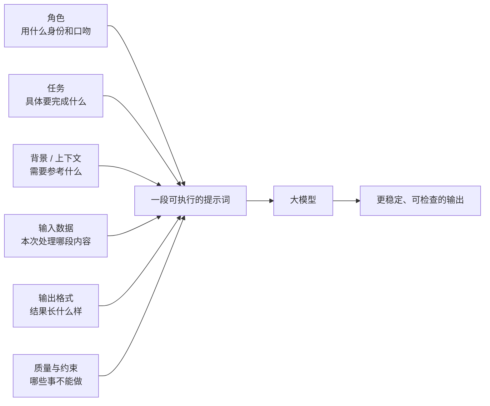

# 1 提示词与提示词工程
## 1.1提示词定义
提示词就是你发给模型的输入内容。它可以是一句话，也可以是一整套结构化消息
最简单的 Prompt，是一句自然语言，比如：

- “谁发明了数字零？”
    
- “讲个笑话”
    
- “给男/女朋友写封情书”
    

任务也可以更复杂，例如：

- 让模型研究你的产品创意的竞争对手
    
- 从零开始构建一个网站
    
- 分析你的企业数据
从入门角度，可以先把 Prompt 理解成“我给模型的一次任务说明”。但从工程角度，Prompt 不只是“一句话问问题”，而是**把角色、任务、上下文、输入和输出规则组织清楚**。

## 1.2 为什么需要提示词
大模型虽然读过海量语料，但是他不会主动知道你这次到底想让他做什么
提示词的作用就是告诉模型：你在扮演什么角色；这次任务是什么；可以参考哪些资料；应该输出成什么样子
提示词不是在“教模型重新学知识”，而是在**激活它当前最该用的那部分能力**。


## 1.3 为什么需要优化提示词
同一个模型，输入不同，输出质量往往差别很大。 高质量 Prompt 的作用，不是把模型“变聪明”，而是减少歧义、减少跑偏、减少格式错误，让模型更稳定地朝着你的目标输出。

它有点像你去看医生：

- 如果只说“我不舒服”，医生很难判断
    
- 如果能清楚描述症状、持续时间、触发条件，判断就会更准确
    

大模型也一样。输入越模糊，输出越容易漂。
### 1.4 提示词工程

提示词工程（Prompt Engineering）指的是： 在使用大模型时，通过系统地**设计、组织、测试和优化 Prompt**，让模型在特定任务、约束和上下文下，尽可能稳定地产出符合目标的结果。

它不是玄学，也不是“多试几次运气好就行”。真正有效的提示词工程，关注的是：

- 需求表达是否清晰
    
- 输入边界是否明确
    
- 输出结构是否可验收
    
- 示例是否足够说明边界
    
- 约束是否自洽
    

所以，本章讲的不是“几个魔法词”，而是一套**可复用、可维护、可迁移**的输入组织方法。
### 1.5 概念补充

#### 1.5.1 上下文

上下文（Context）通常指模型在当前这次生成时可直接访问并用于推理的信息集合。

简单说，上下文就是**这次你实际喂给模型的全部输入**，其中可能包括：

- System 提示词
    
- 用户问题
    
- 历史对话
    
- 检索结果
    
- 工具返回
    


#### 1.5.2 上下文窗口

模型不是能无限接收内容的。它一次最多能处理多长的上下文，是由模型架构和训练决定的，这个长度上限叫**上下文窗口**。

超出上下文窗口后，内容会被截断、压缩，或者根本放不进去。

简单区分：

- **上下文** = 这次喂给模型的全部信息
    
- **上下文窗口** = 模型最多能吃下多少信息
    

这也是为什么：

- 长文档不能无脑全塞
    
- 多轮对话要做摘要或裁剪
    
- 资料太多时，往往要用 RAG


# 2. 提示词怎么写
早期模型能力相对弱，开发者需要大量依赖“技巧型Prompt”，比如复杂提示链、花式引导词、显性推理提示
现在模型能力增强，提示词工程转向"把需求说清除，并让结果可检查"
今天更重要的问题是：

- 任务到底定义清楚了吗？
    
- 输入边界是否明确？
    
- 输出格式是否可验收？
    
- 我有没有给模型足够的背景和示例？
### 2.1 核心六要素和典型构成
虽然并不是每个 Prompt 都必须把六要素写满，但在绝大多数场景下，这六项能帮你把需求组织得更加完整：


一种通用模板如下：
```text

# 角色
你是一名【角色定位，如：数据分析师 / 业务分析师 / 政策研究员】。

# 任务
你的任务是基于给定的输入数据进行【分析 / 总结 / 对比 / 评估】。

# 背景/上下文
【历史记录总结】。
【参考资料】。

# 输入数据
<<<
{在此粘贴输入数据}
>>>

# 输出格式
- 使用表格形式输出
- 表格中必须包含以下列：
 1. 关键发现
 2. 支撑数据（来自输入数据的原文或摘要）
 3. 结论
 4. 建议
- 表格下方需给出整体结论说明

# 质量与约束
- 仅基于输入数据进行分析
- 不得编造、推测或引入外部信息
- 若输入数据不足以支撑结论，必须明确标注为“信息不足”
- 不允许为了完整性而补充假设
  
```
#### 2.2.1角色
角色用于回答“你现在是谁”
它的作用不是给模型贴身份，而是告诉模型：应该用什么专业视角、表达风格和知识深度来完成此次任务
控制口吻语气；控制专业深度；控制思考视角、限定任务边界
通用
```
你是一名【角色定位：数据分析师/业务分析师/政策研究员】
```
举例
```
(❌) 给我一个英语学习计划

(✔️) 我希望你扮演一名优秀的小学英语讲师
我是一名3年纪的学生，给我写一个为期3个月提高英语成绩的学习计划
```
#### 2.2.2任务
任务是prompt的核心，用来回答“你要做什么”
写任务时，注意两点：
- 指令动词开头：用一个强有力的指令动词开始你的任务描述，例如“分析”，“总结”，“提取”，“分类”，“翻译”，“生成”、“重写”、“排序”
- 任务说明：一个好的任务说明必须是明确、具体、无歧义的，比如“写摘要”、“做分类”、“写代码”等
举例 1：

不推荐：目标不明确
```
告诉我关于气候变化的事情。
```
推荐：目标明确
```请简要描述气候变化的主要原因及其对农业的影响。```
举例 2：
```你的任务是基于给定的输入数据进行【分析 / 总结 / 对比 / 评估】。```
举例 3：
```
（弱）谈谈这篇报告

（强）请执行以下三个任务：  
• 总结所附的 2025 年第二季度全球 AI 市场分析报告，篇幅限制在 300 字以内。  
• 提取报告中提到的三大主要增长动力和两大潜在风险。  
• 基于报告内容，为一家计划进入该市场的初创公司提出三条战略建议。
```
你会发现，任务一旦具体，模型更容易稳定命中目标。

#### 2.2.3 背景/上下文
背景/上下文用于回答“**模型完成任务时，还需要知道什么**”。

这部分不是每次都必须有，但当任务涉及特定读者、业务背景、历史聊天记录、参考资料、角色知识边界时，它会很重要。
举例 1：

不推荐：无上下文

```解释一下微积分。```

推荐：有上下文

```作为一名高中生，我正在学习微积分。请用简单的语言解释一下微积分的基本概念。```


举例 2：
```
def provide_context_prompt(topic, expertise_level, background_info):  
    """构建包含上下文的提示词"""  
    prompt = f"""  
    根据以下背景信息：  
    {background_info}  
​  
    请以{expertise_level}水平撰写关于{topic}的详细解释。  
    确保内容准确、结构清晰，并包含实际应用示例。  
    """  
    return prompt  
    
    # 使用示例
background = "读者是计算机专业大三学生，已学习过机器学习基础知识"
topic = "Transformer架构中的多头注意力机制"
prompt = provide_context_prompt(topic, "中级", background)
```
这个例子很好地说明了一点： 上下文并不是“把资料堆进去”，而是给模型一个更准确的理解起点。

#### 2.2.4 要素四：输入数据

输入数据用于告诉模型：“**下面这部分，才是本次真正要处理的内容**”。

为了避免指令、背景和原始文本互相混淆，我们通常会使用**分隔符**把不同部分隔开。常见分隔符包括：
```   """   <<< >>>   <>   <tag></tag> ```

只要能清楚地区分不同文本区域，用哪一种并不绝对，关键是一致且明确。
举例 ：

1）不推荐的提示词
```
将下面的这句话翻译成英文.  
尽量使用华丽的词语
```

AI 回复：

>```
> "春风拂面，百花齐放，万物复苏，大地一片生机勃勃。" Translation:"With the caress of the spring breeze,myriad flowers bloom in unison,all things rejuvenate,and the earth is teeming with vibrant vitality."
>```

2）推荐的提示词
```
把用三个引号括起来的文本翻译成英文  
"""尽量使用华丽的词语"""
```
AI 回复：
```
> "Strive to use magnificent words as much as possible."
```

这个例子很经典，因为它说明了一件事：如果不把“任务说明”和“原始输入”分开，模型就可能把输入文本本身当成新的任务去执行。

#### 2.2.5输出格式
很多时候，我们要的不是一段随意发挥的自然语言，而是**可读、可用、可继续处理**的结构化输出。

常见输出格式包括：

- `JSON`：适合程序处理和结构化提取
    
- `Markdown`：适合文档、报告、可读性展示
    
- `表格`：适合分析、对比、汇总
    
- `代码`：适合生成特定语言的程序片段
#### 2.2.6 要素六：质量与约束

这一要素用于回答两个问题：**怎样算好**，**哪些事不能做**。

它通常包括两部分：

- **质量标准**：例如文风、语气、粒度、专业程度、创造性
    
- **约束条件**：例如字数、来源限制、禁止编造、合规边界
    

常用模板：
```
# 质量与约束
- 仅基于输入数据进行分析
- 不得编造、推测或引入外部信息
- 若输入数据不足以支撑结论，必须明确标注为“信息不足”
- 不允许为了完整性而补充假设
```
### 2.2 Zero-shot 与 Few-shot
#### 2.2.1 Zero-shot
不给任何示例，直接让模型做任务
适用于：任务本身很常见，目标边界清晰，模型本身具备相关能力
举例 1：

翻译这句话：'The cat is on the roof.'

> 猫在屋顶上。

举例 2：

将文本分类为中性、负面或正面。  
​  
Text: 我认为这个假期还不错

> 中性

Zero-shot 的优点是简单、快、成本低，但当任务边界比较模糊时，稳定性往往不如 Few-shot。
#### 2.3.2 Few-shot

Few-shot 指的是：**先给模型几个示例，再让它按示例去完成新任务。**

它特别适合：分类，抽取，改写，风格模仿，结构化输出。

也就是那些“光靠解释还不够，最好直接告诉模型什么算对”的任务。

常见格式：

```
Q: <问题>?  
A: <答案>  
​  
Q: <问题>?  
A: <答案>  
​  
Q: <问题>?  
A: <答案>  
​  
Q: <问题>?  
A:
```

举例 1：

用一句话描述大象的例子是：  
```
大型食草哺乳动物，性格温和，群居生活，分布于亚洲和非洲。  
```
​  
用一句话描述老虎的例子是：

```
> 老虎是大型猫科食肉动物，具有强大的狩猎能力，分布于亚洲。
```

举例 2：

以下是一段示例文本，请你学习它的语气和排版。  
​  
```
示例文本：  
别害怕慢，怕的是停。  
就算今天走得再慢，  
也比昨天原地踏步要好。  
​  
请模仿以上风格，写一段关于"坚持学习AI提示词"的短文案，字数在80-100字。
```

> 别担心起步晚，怕的是从未开始。
> 
> 就算今天只多懂一个指令，
> 
> 也比昨天对 AI 一无所知要强。
> 
> 每一次提问的优化，都是与未来对话的练习。
> 
> 坚持打磨你的提示词，时间会把它变成你手中最敏锐的思维钥匙。

举例 3：

无提示的情况：

``圣诞节圣诞老人会给我带礼物吗？
``
回答：

> 圣诞老人是一个孩子们相信的虚构角色，他通过有关在圣诞前夜乘雪橇、驯鹿以及送礼物的故事，为圣诞节带来了魔力和兴奋。许多家长鼓励这种信仰，因为它能给孩子们增添一层乐趣和惊奇。

有提示的情况：

```
问：牙仙是真的吗？  
答：当然！今晚把你的牙齿放在枕头下。牙仙可能会来拜访并留下些小礼物。  
​  
问：圣诞节圣诞老人会给我带礼物吗？  
答：
```

回答：

> 是的，当然！圣诞老人喜欢给那些相信他并且一整年都表现良好的孩子送礼物。只要你表现得特别乖，留一些饼干，你或许会在圣诞节早晨醒来时发现圣诞树下有礼物！

这个例子很适合理解 Few-shot 的本质：
**示例不是“再解释一遍任务”，而是直接把目标风格演示给模型看。**


# 3.提示词工程的边界
提示词工程很重要，但是他不是万能解法
当问题本质不再是“怎么问”，而是“模型缺知识、缺流程、缺行为稳定性”时，就需要其他模块配合

### 参考资料太多
如果任务必须参考大量资料，而这些资料已经接近或超过模型上下文窗口，单靠 Prompt 已经很难解决。

这时问题不在“提示词不够漂亮”，而在“资料太多，模型吃不下”。

`解决办法`：做资料筛选、摘要，或者直接上 RAG。
## 多步骤复杂流程
当任务包含多个推理步骤时，模型在一次生成里容易出现跳步、漏步或顺序混乱。

例如：

- 先分类再抽取再汇总
    
- 先查资料再写结论再生成表格
    
- 先分析风险再给建议再输出固定结构
    

`解决办法`：把大任务拆成多个小 Prompt，或者用工作流来组织。
### 指令遵循能力不足
如果模型本身对格式、结构和复杂指令的遵循能力不足，Prompt 再怎么修也会有天花板。

一个很有启发的研究结论是：许多模型对提示开头和结尾位置的信息更敏感，而对中间部分更容易“丢失关注”。所以，关键约束要放在显眼位置。
![[模型对提示开头结尾位置更敏感，中间信息更容易忽略图.png]]多数模型在任务描述位于开头时表现更好；也有部分模型对结尾处的关键指令更敏感。无论如何，这张图传达的核心结论都一样：**不要把最重要的要求埋在中间。**
`解决办法`：先把关键要求前置；如果仍然不稳，考虑更合适的模型、结构化输出方案，甚至微调。

### 缺少专业领域知识
在垂直领域里，模型可能根本没有相关知识，或者没有足够熟悉那套领域语言分布。

这时，Prompt 再清楚，也不能凭空补足知识。

`解决办法`：优先补充上下文或知识库；再进一步才考虑微调或续训。